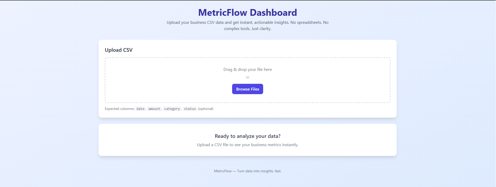
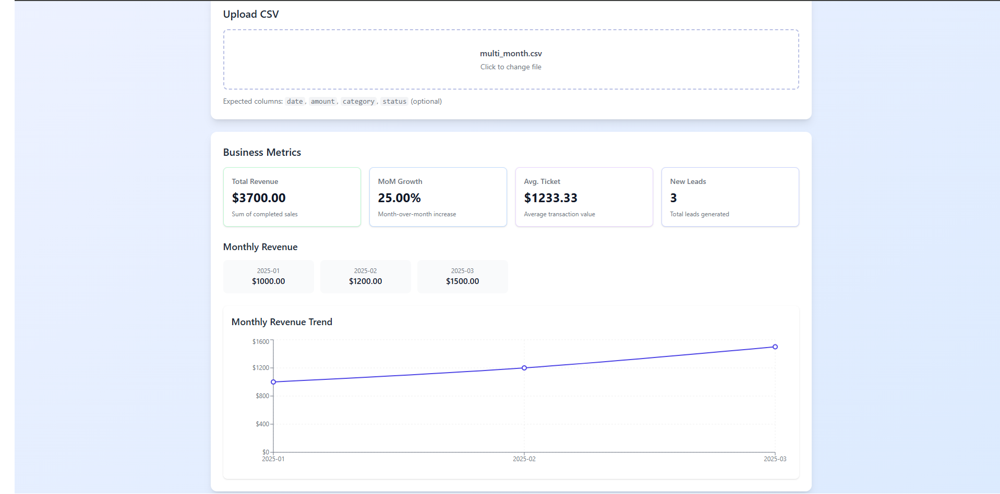

# MetricFlow

**Turn your business data into clear insights—in seconds.**  
No spreadsheets. No complex dashboards. Just upload a CSV and see what matters.

---

### What It Solves for You

You’re busy running your business—not analyzing data.  
Yet you need to know:  
- Are sales growing month over month?  
- What’s your average deal size?  
- How many new leads came in last week?

**MetricFlow gives you instant answers** from the data you already have—usually sitting in a simple CSV file.

Just upload it. Get a clean, visual dashboard. Make decisions with confidence.

---

### How It Works

1. **Prepare your data**  
   Export a CSV with columns like: `date`, `amount`, `category` (e.g., "sale", "lead"), and optionally `status`.

2. **Upload it to MetricFlow**  
   One click. No sign-up. No setup.

3. **See your key metrics instantly**  
   - Total revenue  
   - Month-over-month growth  
   - Average transaction value  
   - New leads over time  
   - Revenue trend chart

That’s it. No training. No onboarding. Just clarity.

---

### Built for People Who Ship

- Founders validating their business model  
- Consultants tracking client results  
- Agencies monitoring campaign performance  
- Freelancers who need quick visibility—without the noise

If you’ve ever wasted hours formatting spreadsheets just to answer a simple question… **MetricFlow is your shortcut.**

---

### ▶ Try It Locally (for developers)

Want to run it yourself? Choose your preferred method:

#### Option 1: Run with Docker Compose (Recommended)

This is the easiest way to run the full application stack with a single command.

```bash
# Clone the repository
git clone https://github.com/python-projects-fernando/metricflow.git  
cd metricflow

# Build and run the full application (backend + frontend)
docker-compose up --build
```

> The application will be available at **http://localhost**  
> The API will be accessible at **http://localhost/api**  
> (The Nginx proxy forwards requests from port 80 to the backend on port 8000)  
> 
> **Environment**: `BACKEND_HOST=backend` is set in `docker-compose.yml` for local proxying.  
> 
> **API Documentation**: The backend service runs independently at `http://localhost:8000`.  
> Access the interactive API documentation at **http://localhost:8000/docs**.

#### Option 2: Run Services Separately

If you prefer to run services individually for development:

1. **Backend (FastAPI)**:
   ```bash
   # Install and run the backend (FastAPI)
   cd backend
   make install
   make run
   ```
   > The API will be running at **http://localhost:8000**  
   > (Requires Python 3.9+ and `make`. On Windows without `make`, see [manual setup](#manual-setup))

2. **Frontend (React + Vite)**:
   ```bash
   # In another terminal, install and run the frontend
   cd frontend
   npm install
   npm run dev
   ```
   > The frontend will be available at **http://localhost:5173**  
   > (Requires Node.js 18+ and npm)

The frontend automatically proxies API requests to the backend, so you can test the full application.

> ⚠ **Note**: This is a focused, production-grade reference implementation—not a full SaaS. It demonstrates how clean code and simple UX can deliver real business value.

---

### Manual Setup (if you don’t have `make` or `npm`)

#### Backend Setup (Python):
```bash
# Backend setup
python -m venv backend/.venv
# On Windows:
backend/.venv\Scripts\activate
# On macOS/Linux:
source backend/.venv/bin/activate

pip install -r backend/requirements.txt
uvicorn backend.interfaces.main:app --reload --port 8000
```

#### Frontend Setup (Node.js):
```bash
# Frontend setup
cd frontend
npm install
npm run dev
```

---

### Sample Data

To quickly test MetricFlow, sample CSV files are included in the `samples/` directory:
- `basic_sales.csv` - Simple sales and leads data
- `multi_month.csv` - Data across multiple months to show MoM growth
- `with_pending_sales.csv` - Includes pending sales (should not count toward revenue)

You can use any of these files to test the dashboard functionality.

---

### Demo

See how simple it is to turn your data into insights with MetricFlow.

#### 1. Easy Upload

*Upload your CSV in seconds with a single click or drag and drop.*

#### 2. Metrics Dashboard

*View your key metrics in a clean, professional dashboard.*

---

### Built by Fernando Magalhães

Fernando is the author of two practical guides for developers who care about **building systems that last**:

- **[SOLID Principles in Python](https://a.co/d/4Zk6KGS)**: Learn to write maintainable, testable code through a real-world Clean Architecture project—no theory without practice.  
- **[Software Engineering – Essential Principles](https://a.co/d/fkU4hXH)**: A no-fluff guide to modern software craftsmanship, trusted by beginners and experienced engineers alike.

MetricFlow reflects that same philosophy: **simple on the surface, solid underneath**.

---

> **MetricFlow: Because knowing your numbers shouldn’t be hard.**
