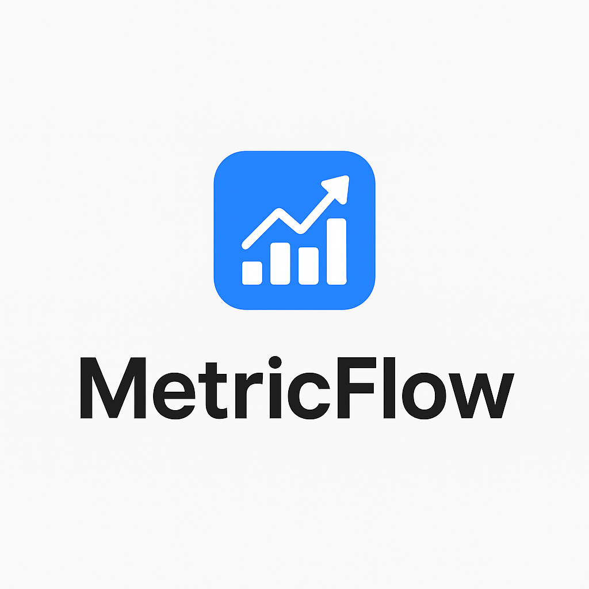
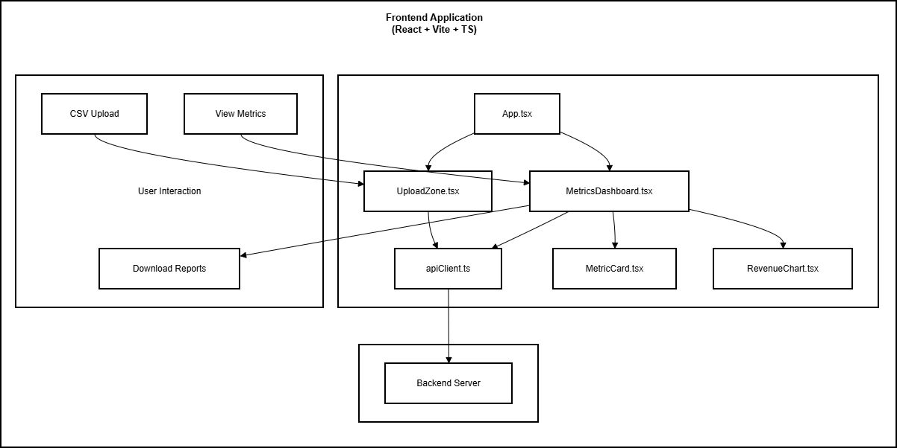
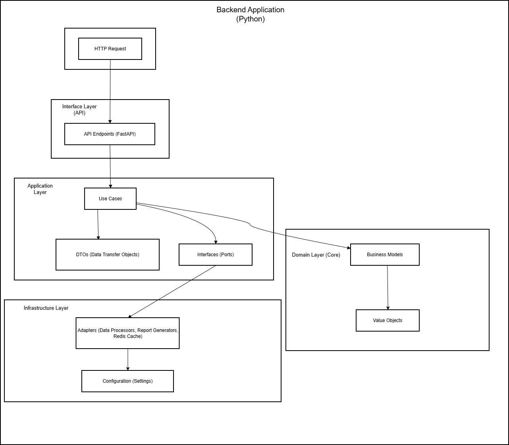
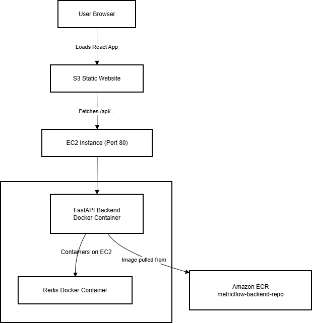

# MetricFlow

<p align="center">
  
</p>

**Turn your business data into clear insights in seconds.**  
No spreadsheets. No complex dashboards. Just upload a CSV and see what matters.
**Export reports as PDF or Excel with 1 click.**

---

### What It Solves for You

You’re busy running your business, not analyzing data.  
Yet you need to know:  
- Are sales growing month over month?  
- What’s your average deal size?  
- How many new leads came in last week?

**MetricFlow gives you instant answers** from the data you already have, usually sitting in a simple CSV file.

Just upload it. Get a clean, visual dashboard. **Export professional reports.** Make decisions with confidence.

---

### How It Works

1.  **Prepare your data**  
    Export a CSV with columns like: `date`, `amount`, `category` (e.g., "sale", "lead"), and optionally `status`.

2.  **Upload it to MetricFlow**  
    One click. No sign-up. No setup.

3.  **See your key metrics instantly**  
    - Total revenue  
    - Month-over-month growth  
    - Average transaction value  
    - New leads over time  
    - Revenue trend chart
    - **Export full report as PDF or Excel with 1 click**

That’s it. No training. No onboarding. Just clarity and **actionable reports**.

---

### Built for People Who Ship

- Founders validating their business model  
- Consultants tracking client results  
- Agencies monitoring campaign performance  

---
If you’ve ever wasted hours formatting spreadsheets just to answer a simple question… **MetricFlow is your shortcut.**

---

> ⚠ **Note**: This is a focused, production-grade reference implementation, not a full SaaS. It demonstrates how clean code, simple UX, and **instant report generation** can deliver real business value.

---

## Experience the Flow

Ready to turn your business data into clear insights in seconds? 
**[Watch Demo Video](https://youtu.be/oX7npLVFjX4?si=4Gpg5dFkOjp41AZ4)** *(Demonstrates the application flow)*<br>
**[Live Demo](http://metricflow-frontend-bucket.s3-website-us-east-1.amazonaws.com/)** *(Application running on AWS)*<br>
---
**[https://fmbyteshiftsoftware.com/](https://fmbyteshiftsoftware.com/)**<br>
**[Contact for Setup](mailto:contact@fmbyteshiftsoftware.com)** *(Schedule a quick setup call)*<br>

---
## Architecture & Deployment

### Application Architecture

This diagram illustrates the high-level structure of the MetricFlow application.

 

 

### Deployment Flow (AWS)

This diagram shows how the application components are deployed and interact on AWS.

 

---

### ▶ Try It Locally (for developers)

#### **Option 1: Run with Docker Compose (Recommended)**

This is the easiest way to run the full application stack with a single command.

1.  **Copy the example compose file:**
    ```bash
    # Clone the repository
    git clone https://github.com/python-projects-fernando/metricflow.git
    cd metricflow

    # Copy the example compose file to the default name
    cp docker-compose.example.yml docker-compose.yml
    ```
2.  **Build and run the full application (backend + frontend + redis):**
    ```bash
    docker-compose -f docker-compose.yml up --build
    ```

> The **frontend** will be available at **http://localhost:5173**  
> The **backend** API will be running at **http://localhost:8000**  
> (Requires Docker and Docker Compose)  
> 
> **Environment**: `VITE_API_BASE_URL=http://localhost:8000/api` is set in `docker-compose.yml` for the frontend.  
> 
> **API Documentation**: Access the interactive API documentation at **http://localhost:8000/docs**.

#### **Option 2: Run Services Separately**

If you prefer to run services individually for development:

1.  **Backend (FastAPI)**:
    1.  Navigate to the backend directory:
        ```bash
        cd backend
        ```
    2.  **Copy the example environment file and configure your settings (like Redis host):**
        ```bash
        cp .env.example .env
        # Edit .env if needed (e.g., set REDIS_HOST if Redis is not on localhost)
        ```
    3.  Install and run the backend:
        ```bash
        make install # Requires Python 3.9+ and make
        make run
        ```
    > The API will be running at **http://localhost:8000**  
    > (Requires Python 3.9+ and `make`. On Windows without `make`, see [manual setup](#manual-setup))

2.  **Frontend (React + Vite)**:
    1.  Open a new terminal and navigate to the frontend directory:
        ```bash
        cd frontend
        ```
    2.  **Copy the example environment file and configure the API URL:**
        ```bash
        cp .env.example .env
        # Edit .env to set VITE_API_BASE_URL (default is http://localhost:8000/api)
        ```
    3.  Install and run the frontend:
        ```bash
        npm install # Requires Node.js 18+ and npm
        npm run dev
        ```
    > The frontend will be available at **http://localhost:5173**  
    > The frontend uses `VITE_API_BASE_URL` from `.env` to connect to the backend.

The frontend automatically uses the configured API URL to communicate with the backend. Ensure Redis is running (e.g., `docker run -p 6379:6379 redis:latest`).

---

### Manual Setup (if you don’t have `make` or `npm`)

#### Backend Setup (Python):
```bash
# Backend setup
python -m venv backend/.venv
# On Windows:
backend/.venv\Scripts\activate
# On macOS/Linux:
source backend/.venv/bin/activate

pip install -r backend/requirements.txt
uvicorn backend.interfaces.main:app --reload --port 8000
```

#### Frontend Setup (Node.js):
```bash
# Frontend setup
cd frontend
npm install
npm run dev
```

---

### Sample Data

To quickly test MetricFlow, sample CSV files are included in the `samples/` directory:
- `basic_sales.csv` - Simple sales and leads data
- `multi_month.csv` - Data across multiple months to show MoM growth
- `with_pending_sales.csv` - Includes pending sales (should not count toward revenue)

You can use any of these files to test the dashboard functionality and **export features**.

---

### Built by Fernando Magalhães

Fernando is the author of two practical guides for developers who care about **building systems that last**:

- **[SOLID Principles in Python](https://a.co/d/4Zk6KGS  )**: Learn to write maintainable, testable code through a real-world Clean Architecture project—no theory without practice.  
- **[Software Engineering – Essential Principles](https://a.co/d/fkU4hXH  )**: A no-fluff guide to modern software craftsmanship, trusted by beginners and experienced engineers alike.

MetricFlow reflects that same philosophy: **simple on the surface, solid underneath**.

---

> **MetricFlow: Because knowing your numbers shouldn’t be hard.**
