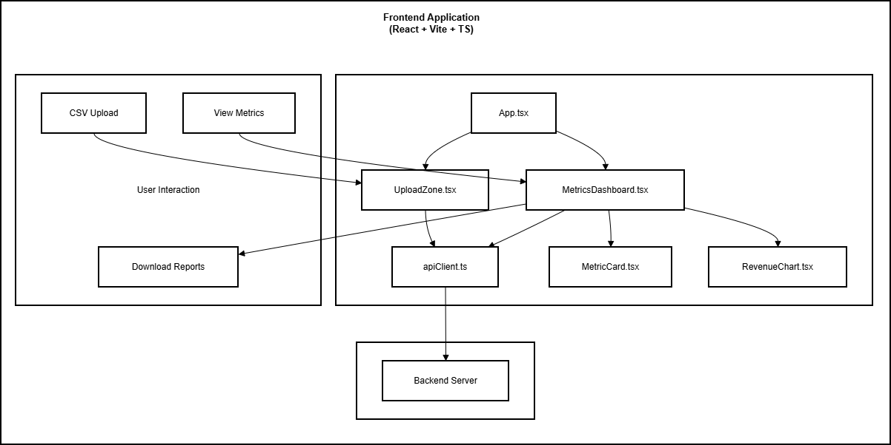
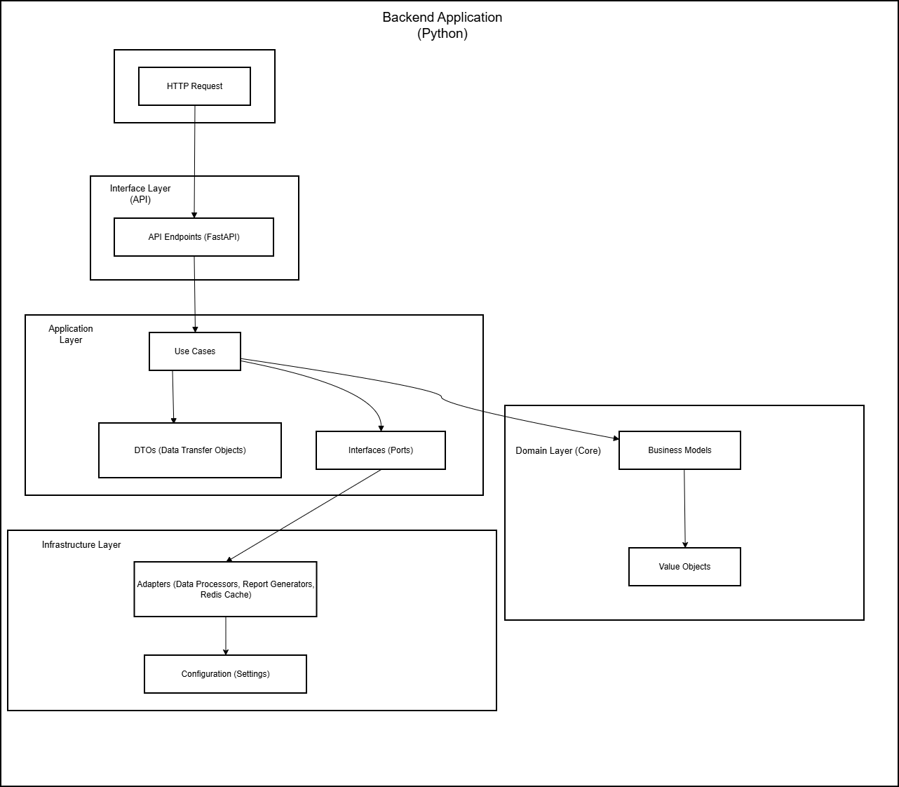

# MetricFlow

## Solution Overview & Architecture

  

---

## Quick Summary (30-second read)

**What:** Business analytics platform transforming CSV data into actionable insights in seconds  
**Why:** Eliminates complex dashboards and manual spreadsheet analysis for faster decision-making  
**How:** Upload CSV data, get instant metrics and professional reports with 1-click export  
**Status:** Production-ready reference implementation  
**GitHub:** github.com/python-projects-fernando/metricflow

_Continue reading for more details and methodology._

---

## Key Takeaways for Decision Makers

✓ **Simple by design:** No complex setup, no training required — upload and get insights immediately  
✓ **Time-saving:** Eliminates hours of manual spreadsheet formatting and analysis  
✓ **Professional output:** Export professional PDF and Excel reports with 1 click  
✓ **Accessible:** Built for founders, consultants, and agencies who need quick clarity  
✓ **Production-grade:** Built with Clean Architecture and modern Python & React practices

---

## Value Proposition

**Business analytics platform** that transforms CSV data into clear, actionable insights in seconds.

Built for **founders, consultants, and agencies** who need quick clarity on sales, leads, and performance metrics without complex dashboards or manual spreadsheet work.

**Key Benefits:**

- Upload CSV data and get instant visibility into revenue, growth, and KPIs
- Eliminate manual spreadsheet formatting and analysis
- Export professional PDF and Excel reports with 1 click
- No training or onboarding required — intuitive interface from day one
- Reduce time-to-insight from hours to seconds

---

## Business Impact & Expected Outcomes

### Measurable Value for Your Organization

| Metric                | Target Impact                    | Why It Matters                                                                |
| --------------------- | -------------------------------- | ----------------------------------------------------------------------------- |
| **Time to Insight**   | From hours to seconds            | Faster decision-making means competitive advantage and operational efficiency |
| **Manual Effort**     | Eliminate spreadsheet formatting | Free up valuable time for strategic analysis instead of data wrangling        |
| **Report Generation** | 1-click professional output      | Consistent, professional reports for stakeholders without manual effort       |
| **User Adoption**     | Zero training required           | Teams can start using immediately without onboarding overhead                 |

### MVP Features That Deliver Value

- Instant CSV upload and parsing with intelligent data detection
- Automatic calculation of key metrics (revenue, MoM growth, averages, trends)
- Visual dashboard with revenue trends, growth metrics, and KPIs
- Professional PDF and Excel report export with 1 click
- Clean, intuitive interface designed for non-technical users
- Secure data handling with no persistent storage

---

## Our Approach: Production-Grade Implementation

### Why This Matters for Your Project

Unlike proof-of-concept demos, MetricFlow is a **production-ready reference implementation** demonstrating how Clean Architecture and modern Python & React practices deliver real business value with simplicity.

**Result:** When you engage for implementation, you receive a system built on proven patterns — reducing risk, rework, and long-term maintenance cost while maintaining simplicity.

### Core Design Principles

| Principle               | Business Benefit                                                            |
| ----------------------- | --------------------------------------------------------------------------- |
| **Simplicity First**    | Users can start getting value immediately without training or complex setup |
| **Clean Architecture**  | Ensures maintainability and flexibility for future enhancements             |
| **Fast Time-to-Value**  | From CSV upload to insights in seconds, not hours                           |
| **Professional Output** | Export-ready reports that look professional without manual formatting       |
| **Scalable Foundation** | Simple now, but built to grow with your business needs                      |

---

## Solution Architecture Overview

### High-Level Design

### Why This Architecture Delivers Value

**Clean Architecture** was implemented because it:

- **Reduces long-term cost:** Clean separation of concerns makes future enhancements easier
- **Accelerates testing:** Isolated business logic enables reliable automated testing
- **Maintains simplicity:** Complex architecture supports simple user experience
- **Future-proofs investment:** Core logic independent of UI or database changes

_For technical readers: Detailed component breakdown and implementation notes are in the Technical Appendix below._

---

## Technology Stack (Production-Ready)

| Category              | Technology               | Rationale                                                          |
| --------------------- | ------------------------ | ------------------------------------------------------------------ |
| **Language**          | Python 3.9+              | Rich data processing ecosystem, strong typing, enterprise adoption |
| **Backend**           | FastAPI                  | High performance, automatic docs, async-ready for data processing  |
| **Frontend**          | React + Vite             | Component reusability, fast development, strong ecosystem          |
| **Data Processing**   | Pandas                   | Powerful CSV parsing and data analysis capabilities                |
| **Report Generation** | Custom PDF/Excel engines | Professional output formats without external dependencies          |
| **Deployment**        | Docker + Docker Compose  | Reproducible environments, easy scaling                            |

_All choices validated through production deployment and documented in project README._

---

## Project Status

**Current Phase:** Production-Ready Reference Implementation  
**Maturity:** Functional — full application deployed and tested  
**Transparency:** Full codebase available on GitHub with setup instructions

**What This Means for You:**  
This is not a proof-of-concept — it's a working reference implementation demonstrating production-grade patterns with a focus on simplicity. When you engage for implementation, you receive a system built on validated, documented choices — not assumptions.

---

## Get in Touch

**Developed by FM ByteShift Software**

**Fernando Magalhães**  
Founder & Lead Architect  
Email: contact@fmbyteshiftsoftware.com  
Website: fmbyteshiftsoftware.com  
GitHub: github.com/python-projects-fernando/metricflow

---

## Technical Appendix (Optional Deep-Dive)

_For technical stakeholders who want implementation details._

### Clean Architecture: Component Breakdown

**Core Layers:**

- **Domain Entities:** Business objects (BusinessRecord, MetricsSummary, StatusEnum) with pure business logic
- **Use Cases:** Orchestration of data processing and report generation
- **Ports:** Interfaces defining how external systems interact with the core
- **Adapters:** Implementations for FastAPI, file upload, PDF/Excel generation

**Key Principles Applied:**

- Dependencies point inward (Dependency Inversion)
- Core logic has zero framework dependencies
- External concerns isolated for easy testing and replacement

### Data Processing Flow

1. **CSV Upload:** User uploads CSV file through React frontend
2. **Validation:** Backend validates file format and structure
3. **Parsing:** Processes CSV and extracts data
4. **Metrics Calculation:** Business logic calculates KPIs (revenue, MoM growth, averages)
5. **Visualization:** Frontend renders charts and metrics dashboard
6. **Export:** User can export professional PDF or Excel report with 1 click

### Security & Data Handling

- **No persistent storage:** CSV data processed in-memory, not stored
- **Secure file upload:** Validation of file types and size limits
- **Session isolation:** Each user session isolated from others
- **No data retention:** Data cleared after session ends

### Deployment Options

**Docker Compose (Recommended):**

- Full application stack (frontend, backend, Redis) with single command
- Reproducible environments across development and production
- Easy scaling and maintenance

**Local Execution:**

- Backend and frontend can run separately for development
- Flexible configuration via `.env` files
- Comprehensive setup documentation in README

### MVP Implementation Scope

Current implementation includes:

- CSV upload with intelligent column detection
- Automatic calculation of revenue, MoM growth, averages, and trends
- Visual dashboard with charts and key metrics
- Professional PDF report generation
- Excel export with formatted data
- Responsive design for desktop and mobile
- Docker Compose setup for one-command deployment

_All components follow Clean Architecture patterns and production-grade practices._

---

_This document reflects the current state of the MetricFlow reference implementation. All patterns and decisions are production-validated and documented in the project README._
